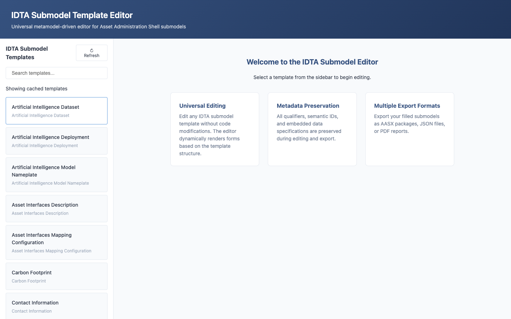
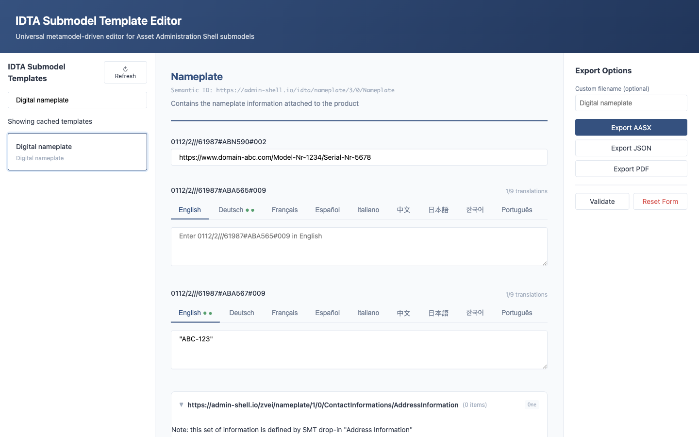

# Universal IDTA Submodel Template Editor

A metamodel-driven application for editing any IDTA submodel template without code modifications. Built with Eclipse BaSyx Python SDK 2.0.0, FastAPI, and React 18+ with TypeScript.

## Features

- **Universal Editing**: Edit any IDTA submodel template (Digital Nameplate, Carbon Footprint, Technical Data, etc.) through the same interface
- **Metadata Preservation**: Qualifiers, EmbeddedDataSpecifications, and semantic IDs are preserved during editing
- **Multiple Export Formats**: Export filled submodels as AASX packages, JSON files, or PDF reports
- **Recursive Form Rendering**: Automatically handles nested SubmodelElementCollections and SubmodelElementLists
- **Template Discovery**: Automatically fetches templates from the official IDTA repository
- **Validation**: Client-side and server-side validation based on cardinality constraints

## Architecture

The application follows a three-pipeline architecture:

1. **Fetcher Service**: Discovers and caches IDTA templates from GitHub
2. **Parser Service**: Transforms AAS structures into UI-agnostic JSON schema
3. **Hydrator Service**: Reconstitutes complete AAS objects by merging user input with preserved metadata

## Quick Start

## Three-Step Demo

1. **Start the stack**
   ```bash
   docker-compose up
   ```
2. **Open the UI**  
   Visit `http://localhost:8080` and select a template (e.g., “Digital Nameplate”).
3. **Fill & export**  
   Complete the form and export as **AASX**, **JSON**, or **PDF** from the Export panel.

Screenshots (Digital Nameplate example):





### Using Docker Compose

```bash
# Clone the repository
git clone https://github.com/your-org/idta-submodel-editor.git
cd idta-submodel-editor

# Start the application
docker-compose up

# Access the application
# Frontend: http://localhost:8080
# Backend API: http://localhost:8000
# API Documentation (Swagger): http://localhost:8000/api/docs
# API Documentation (ReDoc): http://localhost:8000/api/redoc
```

### Development Setup

#### Backend

```bash
cd backend

# Create virtual environment
python -m venv venv
source venv/bin/activate  # On Windows: venv\Scripts\activate

# Install dependencies
pip install -r requirements.txt

# Run development server
uvicorn app.main:app --reload --port 8000
```

#### Frontend

```bash
cd frontend

# Install dependencies
npm install

# Run development server
npm run dev
```

## Configuration

### Environment Variables

#### Backend

| Variable | Description | Default |
|----------|-------------|---------|
| `ENV` | Environment (development, staging, production) | development |
| `SECRET_KEY` | Secret key for signing | Required in production |
| `GITHUB_TOKEN` | GitHub API token for higher rate limits | Optional |
| `CORS_ORIGINS` | Allowed CORS origins | http://localhost:8080 |
| `CACHE_TTL_HOURS` | Template cache TTL in hours | 24 |
| `MAX_UPLOAD_SIZE_MB` | Maximum upload file size | 50 |
| `PDF_ENABLED` | Enable PDF export | true |
| `OIDC_ENABLED` | Enable OAuth2/OIDC authentication | false |
| `OIDC_ISSUER_URL` | OIDC issuer URL | - |
| `OIDC_AUDIENCE` | OIDC audience | - |
| `REDIS_URL` | Redis URL for distributed caching | Optional |

#### Frontend

| Variable | Description | Default |
|----------|-------------|---------|
| `VITE_API_URL` | Backend API URL | http://localhost:8000 |

## API Endpoints

### Templates

- `GET /api/templates` - List available templates
- `GET /api/templates/{name}` - Get template information
- `GET /api/templates/{name}/versions` - Get template versions
- `POST /api/templates/refresh` - Refresh template cache

### Editor

- `GET /api/editor/templates/{name}/schema` - Get UI schema for a template
- `POST /api/editor/hydrate/{name}` - Hydrate template with form data (returns AASX)
- `POST /api/editor/hydrate/{name}/json` - Hydrate template (returns JSON)
- `POST /api/editor/upload` - Upload and parse an AASX file
- `POST /api/editor/validate/{name}` - Validate form data

### Export

- `POST /api/export/{name}?format=aasx|json|pdf` - Export filled submodel
- `GET /api/export/{name}/preview` - Get template preview
- `POST /api/export/batch` - Batch export as ZIP

## Supported Element Types

| Element Type | Editing Support |
|--------------|-----------------|
| Property | Full |
| SubmodelElementCollection | Full (recursive) |
| SubmodelElementList | Full (add/remove items) |
| MultiLanguageProperty | Full (tabbed interface) |
| File | Full (path/URL + content type) |
| Range | Full (min/max) |
| ReferenceElement | Full |
| Entity | Full |
| Blob | Read-only |
| RelationshipElement | Partial |
| Operation | Read-only |
| Capability | Read-only |
| BasicEventElement | Read-only |

## Deployment

### Kubernetes

```bash
# Apply base manifests
kubectl apply -k kubernetes/base

# Or apply environment-specific overlay
kubectl apply -k kubernetes/overlays/production
```

### Docker

```bash
# Build images
docker build -t submodel-editor-backend:1.0.0 ./backend
docker build -t submodel-editor-frontend:1.0.0 ./frontend

# Run containers
docker run -d -p 8000:8000 submodel-editor-backend:1.0.0
docker run -d -p 80:80 submodel-editor-frontend:1.0.0
```

## Project Structure

```
idta-submodel-editor/
├── backend/
│   ├── app/
│   │   ├── services/       # Fetcher, Parser, Hydrator
│   │   ├── routers/        # API endpoints
│   │   ├── schemas/        # Pydantic models
│   │   ├── utils/          # XSD mapping, semantic resolver
│   │   └── clients/        # GitHub API client
│   ├── tests/
│   └── Dockerfile
├── frontend/
│   ├── src/
│   │   ├── components/     # React components
│   │   │   ├── AASRenderer/    # Recursive form renderer
│   │   │   ├── TemplateSelector/
│   │   │   └── ExportPanel/
│   │   ├── hooks/          # Custom React hooks
│   │   ├── services/       # API client
│   │   └── types/          # TypeScript interfaces
│   └── Dockerfile
├── kubernetes/
│   ├── base/               # Base manifests
│   └── overlays/           # Environment overlays
├── docker-compose.yaml
└── README.md
```

## Technology Stack

### Backend
- Python 3.11+
- FastAPI
- Eclipse BaSyx Python SDK 2.0.0
- Pydantic v2
- WeasyPrint (PDF generation)

### Frontend
- React 18
- TypeScript
- React Hook Form
- Zod (validation)
- Vite (build tool)

### Infrastructure
- Docker & Docker Compose
- Kubernetes with Kustomize
- Redis (optional caching)
- Keycloak (optional authentication)

## Contributing

1. Fork the repository
2. Create a feature branch
3. Make your changes
4. Run tests
5. Submit a pull request

## License

This project is licensed under the MIT License.

## Acknowledgments

- [IDTA](https://industrialdigitaltwin.org/) for the submodel template specifications
- [Eclipse BaSyx](https://www.eclipse.org/basyx/) for the AAS SDK
- [admin-shell-io](https://github.com/admin-shell-io/submodel-templates) for hosting the template repository
