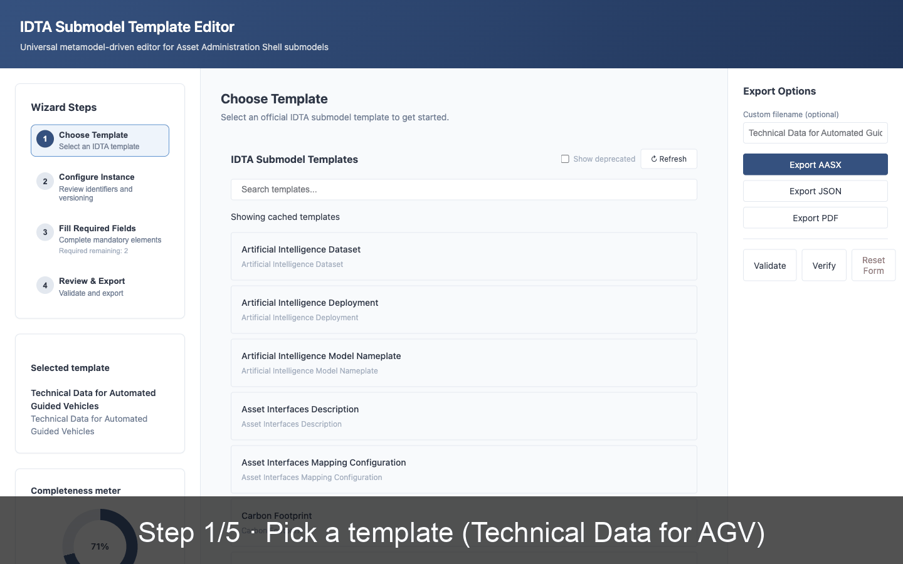
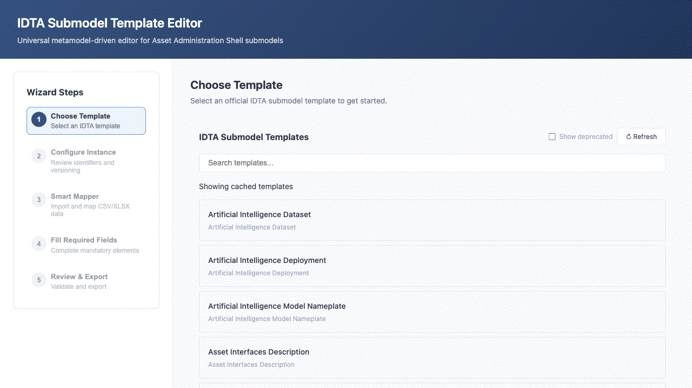
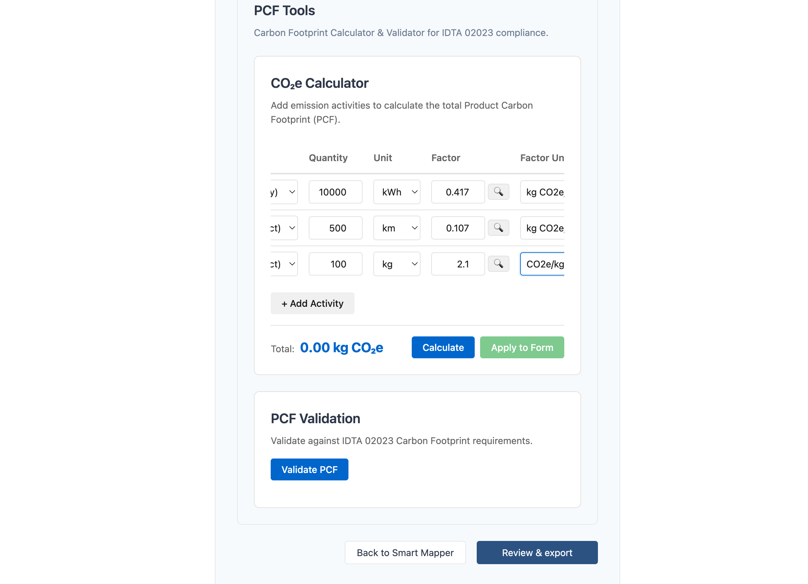
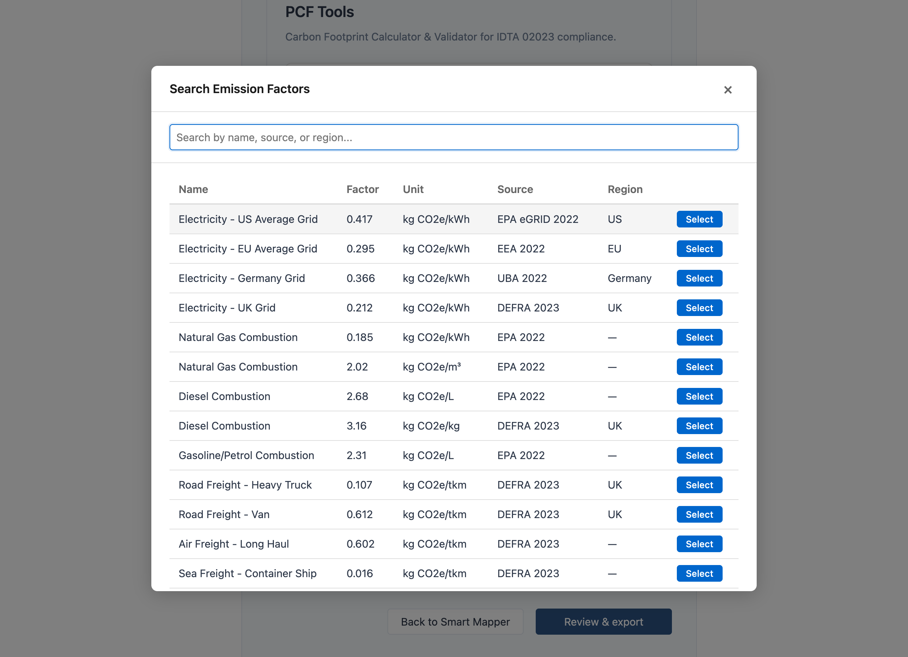
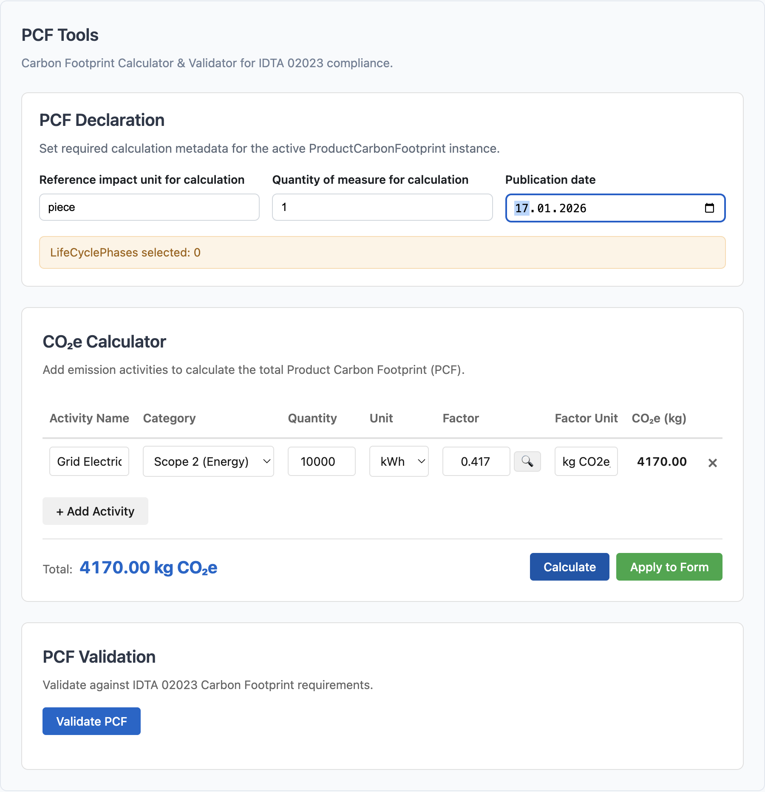

# Universal IDTA Submodel Template Editor

A metamodel-driven application for editing any IDTA submodel template without code modifications. Built with Eclipse BaSyx Python SDK 2.0.0, FastAPI, and React 18+ with TypeScript.

## Features

- **Universal Editing**: Edit any IDTA submodel template (Digital Nameplate, Carbon Footprint, Technical Data, etc.) through the same interface
- **Metadata Preservation**: Qualifiers, EmbeddedDataSpecifications, and semantic IDs are preserved during editing
- **Multiple Export Formats**: Export filled submodels as AASX packages, JSON files, or PDF reports
- **Recursive Form Rendering**: Automatically handles nested SubmodelElementCollections and SubmodelElementLists
- **Template Discovery**: Automatically fetches templates from the official IDTA repository
- **Validation**: Client-side and server-side validation based on cardinality and type constraints (server-side enforced on hydrate/export)
- **Template Status + Versions**: Browse published/deprecated templates and select versions where available
- **Semantic Dictionary Lookup**: Search ECLASS / IEC CDD, resolve semantics, and apply to fields with typing hints
- **Smart Mapper (CSV/XLSX)**: Profile spreadsheets, map columns to elements, and reuse recipes for bulk imports
- **PCF Calculator & Validator**: Calculate Product Carbon Footprint (CO₂e) from emission activities and validate against IDTA 02023 rules

## Semantic Dictionary Lookup + Resolver

Attach standardized semantic identifiers (ECLASS / IEC CDD) to SubmodelElements.
This is especially important for “generic frame” templates (e.g., Technical Data)
where users must define domain-specific properties and need correct semantics.

Live demo (Semantic Lookup in action):



### Goal

Enable users to search, select, and apply standardized semantic identifiers while
preserving metadata and keeping the Fetcher → Parser → Hydrator → Validation
pipeline intact.

### Why this is demanded (and why it’s tricky)

1. AAS semantics are required for interoperability (matching strategies and ID examples).
2. IDTA submodel context stresses dictionaries like ECLASS and IEC CDD.
3. ECLASS access is certificate-authenticated and costed per IRDI → caching + throttling are required.
4. Dictionary data types can suggest correct AAS element type/valueType (e.g., STRING_TRANSLATABLE).

### Scope (MVP)

- **Semantic Search UI**: search box + provider/kind/language filters, results list, details drawer, apply-to-field
- **Backend semantic service**: `/api/semantic/providers`, `/api/semantic/search`, `/api/semantic/resolve`, `/api/semantic/apply-preview`
- **ECLASS provider**: offline index + optional online webservice (mTLS, rate-limited)
- **IEC CDD provider**: offline index first, pluggable for future APIs
- **Resolver**: given semanticId, show label/definition from available providers

Out of scope (initially):
- Global ConceptDescription registry sync
- ECLASS↔IEC CDD reconciliation
- Bundling licensed datasets in the repo

### Apply logic

- Prefer IRI when available, otherwise IRDI string.
- Apply preview suggests element type/valueType based on dictionary datatype.
- Optional ConceptDescription embedding at export time (configurable).

### Offline index

The offline index supports JSON/CSV and SQLite FTS. See:
`docs/semantic/indexing.md`

## Smart Mapper (CSV/XLSX Bulk Import)

Smart Mapper lets you upload a spreadsheet, map columns to template fields, and
apply the results directly into the editor form. Save recipes for monthly
imports and re-run with minimal setup.

Live demo (Smart Mapper in action):


- Profile CSV/XLSX headers + sample rows with **column statistics** (null rate, distinct count)
- Drag-and-drop columns onto targets with a visual mapping canvas
- **Semantic-aware auto-mapping** suggests matches using semantic synonyms and field names
- Map columns → idShortPath targets (including list paths via `[]`)
- **Transformation options** per mapping: trim whitespace, decimal/thousands separators, date format
- Import modes: single, row-per-submodel, and grouped (build list items per group)
- Save recipes locally or to the server (OIDC-aware scoping)
- **Template version tracking** warns when the template has been updated since the recipe was saved
- **Dry-run preview** shows mapped values before applying to the form
- Validation panel flags unmapped required fields and parsing warnings

## PCF Calculator & Validator (Carbon Footprint)

Calculate Product Carbon Footprint (PCF) values and validate against IDTA 02023 specification requirements. This tool appears automatically when editing Carbon Footprint templates.

Live demo (PCF Calculator in action):



### CO₂e Calculator

Build emission activity tables and compute total CO₂e with a few clicks:

- **Add emission activities** with name, GHG Protocol category (Scope 1/2/3), quantity, and unit
- **Search emission factors** from a built-in database (EPA, DEFRA, ecoinvent, IEA sources)
- **Automatic calculation** with unit conversion support (kg, t, kWh, MJ, km, L, m³)
- **Apply to form** writes the calculated total directly to the `PcfCO2eq` field

| Screenshot | Description |
|------------|-------------|
|  | Add emission activities with quantities and factors |
|  | Search and select from 20+ emission factors |
|  | Calculate total and apply to form |

### IDTA 02023 Validator

Validate your Carbon Footprint data against the official IDTA 02023 specification:

- **Blocking errors** for required fields: `PcfCO2eq`, `ReferenceImpactUnitForCalculation`, `QuantityOfMeasureForCalculation`, `PublicationDate`, `LifeCyclePhases`
- **Warnings** for recommended fields and value list conformance
- **Cross-field validation**: `ExpirationDate` must be after `PublicationDate`
- **Completeness score** shows percentage of PCF fields filled
- **Export-time enforcement**: Carbon Footprint exports are blocked if validation fails

### Emission Factors Database

The built-in database includes common emission factors from recognized authorities:

| Category | Examples | Sources |
|----------|----------|---------|
| Electricity | US/EU/UK/Germany grid averages | EPA eGRID, EEA, UBA, DEFRA |
| Fuels | Natural gas, diesel, gasoline | EPA, DEFRA |
| Transport | Road freight, air freight, sea freight | DEFRA |
| Materials | Steel, aluminum, plastics (primary & recycled) | ecoinvent |
| Water | Supply and treatment | DEFRA |

Factors include value, unit, source reference, region, and year for full traceability.

## Architecture

The application follows a three-pipeline architecture:

1. **Fetcher Service**: Discovers and caches IDTA templates from GitHub
2. **Parser Service**: Transforms AAS structures into UI-agnostic JSON schema
3. **Hydrator Service**: Reconstitutes complete AAS objects by merging user input with preserved metadata
4. **Validation Service**: Shared validation used by validate/hydrate/export endpoints

## Quick Start

## Three-Step Demo

1. **Start the stack**
   ```bash
   docker-compose up
   ```
2. **Open the UI**  
   Visit `http://localhost:8080` and select a template (e.g., “Digital Nameplate”).
3. **Fill & export**  
   Complete the form and export as **AASX**, **JSON**, or **PDF** from the Export panel.

### Using Docker Compose

```bash
# Clone the repository
git clone https://github.com/your-org/idta-submodel-editor.git
cd idta-submodel-editor

# Start the application
docker-compose up

# Access the application
# Frontend: http://localhost:8080
# Backend API: http://localhost:8000
# API Documentation (Swagger): http://localhost:8000/api/docs
# API Documentation (ReDoc): http://localhost:8000/api/redoc
```

### Development Setup

#### Backend

```bash
cd backend

# Create virtual environment
python -m venv venv
source venv/bin/activate  # On Windows: venv\Scripts\activate

# Install dependencies
pip install -r requirements.txt

# Run development server
uvicorn app.main:app --reload --port 8000
```

#### Frontend

```bash
cd frontend

# Install dependencies
npm install

# Run development server
npm run dev

# Lint and type-check
npm run lint
npm run type-check
```

## Configuration

### Environment Variables

#### Backend

| Variable | Description | Default |
|----------|-------------|---------|
| `ENV` | Environment (development, staging, production) | development |
| `SECRET_KEY` | Secret key for signing | Required in production |
| `GITHUB_TOKEN` | GitHub API token for higher rate limits | Optional |
| `CORS_ORIGINS` | Allowed CORS origins | http://localhost:8080 |
| `CACHE_TTL_HOURS` | Template cache TTL in hours | 24 |
| `MAX_UPLOAD_SIZE_MB` | Maximum upload file size | 50 |
| `PDF_ENABLED` | Enable PDF export | true |
| `OIDC_ENABLED` | Enable OAuth2/OIDC authentication | false |
| `OIDC_ISSUER_URL` | OIDC issuer URL | - |
| `OIDC_AUDIENCE` | OIDC audience | - |
| `REDIS_URL` | Redis URL for distributed caching | Optional |
| `SEMANTIC_ENABLED` | Enable semantic lookup | true |
| `SEMANTIC_PREFER_IRI` | Prefer IRI when available | true |
| `SEMANTIC_ECLASS_OFFLINE_ENABLED` | Enable ECLASS offline index | true |
| `SEMANTIC_IEC_CDD_OFFLINE_ENABLED` | Enable IEC CDD offline index | true |
| `SEMANTIC_ECLASS_ONLINE_ENABLED` | Enable ECLASS online webservice | false |
| `ECLASS_API_BASE` | ECLASS webservice base URL | - |
| `ECLASS_SEARCH_URL` | Search endpoint (relative or absolute) | - |
| `ECLASS_RESOLVE_URL` | Resolve endpoint (relative or absolute) | - |
| `ECLASS_CERT_PATH` | Client certificate path | - |
| `ECLASS_KEY_PATH` | Client key path | - |
| `SEMANTIC_CACHE_TTL_SECONDS` | Semantic cache TTL (sec) | 86400 |
| `SEMANTIC_SEARCH_RATE_LIMIT_PER_MIN` | Search rate limit | 60 |
| `SEMANTIC_RESOLVE_RATE_LIMIT_PER_MIN` | Resolve rate limit | 120 |
| `ECLASS_INDEX_PATH` | Offline index path (JSON/CSV/SQLite) | ./cache/semantic/eclass.json |
| `IEC_CDD_INDEX_PATH` | Offline index path (JSON/CSV/SQLite) | ./cache/semantic/iec_cdd.json |
| `SEMANTIC_EMBED_CONCEPT_DESCRIPTIONS` | Embed ConceptDescriptions on export | false |

#### Frontend

| Variable | Description | Default |
|----------|-------------|---------|
| `VITE_API_URL` | Backend API URL | http://localhost:8000 |

## API Endpoints

### Templates

- `GET /api/templates` - List available templates (`status=published|deprecated|all`)
- `GET /api/templates/{name}` - Get template information (`status=published|deprecated|all`)
- `GET /api/templates/{name}/versions` - Get template versions (`status=published|deprecated`)
- `POST /api/templates/refresh` - Refresh template cache

### Editor

- `GET /api/editor/templates/{name}/schema` - Get UI schema for a template (`status=published|deprecated`, `version=...`)
- `POST /api/editor/hydrate/{name}` - Hydrate template with form data (returns AASX, validates server-side)
- `POST /api/editor/hydrate/{name}/json` - Hydrate template (returns JSON, validates server-side)
- `POST /api/editor/upload` - Upload and parse an AASX file
- `POST /api/editor/validate/{name}` - Validate form data (`status=published|deprecated`, `version=...`)

### Export

- `POST /api/export/{name}?format=aasx|json|pdf` - Export filled submodel (validates server-side)
- `GET /api/export/{name}/preview` - Get template preview (`status=published|deprecated`, `version=...`)
- `POST /api/export/batch` - Batch export as ZIP

### Semantic

- `GET /api/semantic/providers` - List available semantic providers
- `GET /api/semantic/search` - Search semantic dictionaries
- `GET /api/semantic/resolve` - Resolve an ID/IRI to metadata
- `POST /api/semantic/apply-preview` - Suggest semanticId + type warnings

### Mapper

- `POST /api/mapper/profile` - Profile CSV/XLSX headers + sample rows (includes column statistics)
- `POST /api/mapper/auto-suggest` - Auto-suggest column mappings using semantic matching
- `POST /api/mapper/run` - Run mapping (form or export output)
- `GET /api/mapper/recipes` - List saved recipes (scoped by OIDC user if enabled)
- `POST /api/mapper/recipes` - Save recipe to server
- `GET /api/mapper/recipes/{name}` - Fetch a recipe
- `DELETE /api/mapper/recipes/{name}` - Delete a recipe

### PCF (Carbon Footprint)

- `POST /api/pcf/calculate` - Calculate CO₂e emissions from activity data
- `POST /api/pcf/validate` - Validate PCF form data against IDTA 02023 rules
- `GET /api/pcf/factors/search` - Search emission factors by name, source, or region
- `GET /api/pcf/factors/{factor_id}` - Get a specific emission factor by ID
- `GET /api/pcf/health` - Check PCF service health status

## Supported Element Types

| Element Type | Editing Support |
|--------------|-----------------|
| Property | Full |
| SubmodelElementCollection | Full (recursive) |
| SubmodelElementList | Full (add/remove items) |
| MultiLanguageProperty | Full (tabbed interface) |
| File | Full (path/URL + content type) |
| Range | Full (min/max) |
| ReferenceElement | Full |
| Entity | Full |
| Blob | Read-only |
| RelationshipElement | Partial |
| Operation | Read-only |
| Capability | Read-only |
| BasicEventElement | Read-only |

## Deployment

### Kubernetes

```bash
# Apply base manifests
kubectl apply -k kubernetes/base

# Or apply environment-specific overlay
kubectl apply -k kubernetes/overlays/production
```

### Docker

```bash
# Build images
docker build -t submodel-editor-backend:1.0.0 ./backend
docker build -t submodel-editor-frontend:1.0.0 ./frontend

# Run containers
docker run -d -p 8000:8000 submodel-editor-backend:1.0.0
docker run -d -p 80:80 submodel-editor-frontend:1.0.0
```

## Project Structure

```
idta-submodel-editor/
├── backend/
│   ├── app/
│   │   ├── services/       # Fetcher, Parser, Hydrator, Validation, PCF, Semantic, Mapper
│   │   │   └── pcf/        # PCF Calculator, Validator, Emission Factors
│   │   ├── routers/        # API endpoints (templates, editor, export, semantic, mapper, pcf)
│   │   ├── schemas/        # Pydantic models
│   │   ├── utils/          # XSD mapping, semantic resolver
│   │   └── clients/        # GitHub API client
│   ├── tests/
│   │   ├── fixtures/       # AASX/JSON conformance fixtures + generator
│   │   └── pcf/            # PCF-specific tests
│   └── Dockerfile
├── frontend/
│   ├── src/
│   │   ├── components/     # React components
│   │   │   ├── AASRenderer/    # Recursive form renderer
│   │   │   ├── TemplateSelector/
│   │   │   ├── ExportPanel/
│   │   │   ├── SmartMapper/    # CSV/XLSX bulk import
│   │   │   └── PCFPanel/       # PCF Calculator & Validator
│   │   ├── hooks/          # Custom React hooks
│   │   ├── services/       # API client (api, pcfApi, mapperApi)
│   │   └── types/          # TypeScript interfaces
│   └── Dockerfile
├── docs/
│   ├── semantic/           # Semantic lookup documentation
│   ├── mapper/             # Smart Mapper documentation
│   └── pcf/                # PCF Calculator documentation
├── kubernetes/
│   ├── base/               # Base manifests
│   └── overlays/           # Environment overlays
├── docker-compose.yaml
└── README.md
```

## Technology Stack

### Backend
- Python 3.11+
- FastAPI
- Eclipse BaSyx Python SDK 2.0.0
- Pydantic v2
- WeasyPrint (PDF generation)

### Frontend
- React 18
- TypeScript
- React Hook Form
- Zod (validation)
- Vite (build tool)
- ESLint (linting)

### Infrastructure
- Docker & Docker Compose
- Kubernetes with Kustomize
- Redis (optional caching)
- Keycloak (optional authentication)

## Contributing

1. Fork the repository
2. Create a feature branch
3. Make your changes
4. Run tests and lint checks
5. Submit a pull request

## CI & Conformance Fixtures

- CI runs backend tests, frontend lint/type-check/build, and AAS conformance checks.
- Conformance fixtures live in `backend/tests/fixtures/` and are generated by
  `backend/tests/fixtures/generate_fixtures.py`.
- A nightly workflow refreshes fixtures and opens a PR. Set the
  `FIXTURE_SECRET_KEY` repository secret (32+ characters).

## License

This project is licensed under the MIT License.

## Acknowledgments

- [IDTA](https://industrialdigitaltwin.org/) for the submodel template specifications
- [Eclipse BaSyx](https://www.eclipse.org/basyx/) for the AAS SDK
- [admin-shell-io](https://github.com/admin-shell-io/submodel-templates) for hosting the template repository
