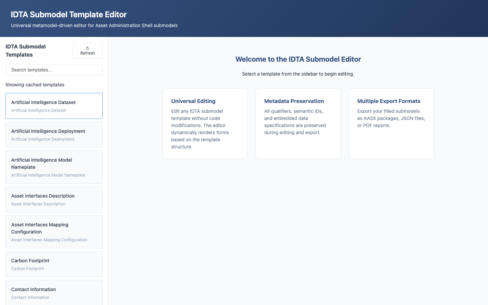

# Universal IDTA Submodel Template Editor

[](https://github.com/hadijannat/idta-submodel-editor/actions/workflows/ci.yml)
[](https://github.com/hadijannat/idta-submodel-editor/actions/workflows/docs.yml)
[](https://github.com/hadijannat/idta-submodel-editor/releases)
[](LICENSE.txt)
[](https://doi.org/10.5281/zenodo.18374723)

A metamodel-driven application for editing IDTA submodel templates without code changes.

**Quick links**
- Documentation: <https://hadijannat.github.io/idta-submodel-editor/>
- Releases: <https://github.com/hadijannat/idta-submodel-editor/releases>
- Changelog: [CHANGELOG.md](CHANGELOG.md)
- Contributing: [CONTRIBUTING.md](CONTRIBUTING.md)
- Citation: [CITATION.cff](CITATION.cff)
- Security policy: [.github/SECURITY.md](.github/SECURITY.md)



## What This Solves

- Build compliant IDTA submodels from templates with no code changes.
- Start from template data, spreadsheet mappings, or PDF extraction workflows.
- Validate constraints before export.
- Export submodels as AASX, JSON, or PDF and optionally publish to dataspace targets.

## Concepts

- **Submodel Template (SMT):** a reusable structure that guides how a submodel should be created (`kind = Template`).
- **Submodel Instance:** a concrete submodel filled with asset-specific values.
- **Template source defaults:** templates are fetched from `GITHUB_REPO=admin-shell-io/submodel-templates` at `GITHUB_TEMPLATE_REF=main`.
- **Local overrides:** enable local templates with `LOCAL_TEMPLATES_ENABLED=true` and `LOCAL_TEMPLATES_DIR`.

## Quick Start (2 Minutes)

Prerequisite: Docker Engine + Docker Compose v2.

```bash
# from repo root
docker compose up
```

Open: `http://localhost:8080`

### Core URLs

| Service | URL | Notes |
|---|---|---|
| Frontend | `http://localhost:8080` | Main UI |
| Backend API | `http://localhost:8000` | REST API |
| Swagger UI | `http://localhost:8000/api/docs` | Available when `ENV != production` |
| Health | `http://localhost:8000/health` | Basic liveness indicator |
| AAS Browser (Mnestix) | `http://localhost:3001` | Available with `dataspace` profile |

> [!NOTE]
> The core workflow (`docker compose up`) runs locally without external API keys.

## Runtime Profiles

| Profile | Command | Adds |
|---|---|---|
| Core | `docker compose up` | Backend, frontend, Redis |
| Magic Import Worker | `docker compose --profile magic-import up` | Celery worker for async extraction jobs |
| Dataspace | `docker compose --profile dataspace up` | BaSyx, DTR, Vault, EDC, Postgres, Mnestix |
| PLC Bridge | `docker compose --profile plc up` | PLC4X bridge + required BaSyx services |
| Auth | `docker compose --profile auth up` | Keycloak (host port defaults to `8081`) |

> [!WARNING]
> Running the `auth` profile alone does not enforce authentication. Auth is enforced only when OIDC backend settings are enabled (for example `OIDC_ENABLED=true` with issuer/audience configured).

## Configuration

Copy the example environment file:

```bash
cp .env.example .env
```

Minimal knobs used most often:
- Template source: `GITHUB_REPO`, `GITHUB_TEMPLATE_REF`, `LOCAL_TEMPLATES_DIR`
- Magic Import: `MAGIC_IMPORT_ENABLED`, `MAGIC_IMPORT_LLM_PROVIDER`, `MAGIC_IMPORT_LLM_MODEL`, provider API key
- Dataspace: `DATASPACE_ENABLED`
- Auth/OIDC: `OIDC_ENABLED`, `OIDC_ISSUER_URL`, `OIDC_AUDIENCE`

Full variable matrix: [docs/reference/configuration.md](docs/reference/configuration.md)

## Local Development

Prerequisites:
- Python `3.11+` (Docker image uses `3.14`; CI validates `3.11`)
- Node.js `>=20.19.0` (Docker and CI use `25`)

Backend:

```bash
cd backend
python -m venv .venv
source .venv/bin/activate
pip install -r requirements.txt
uvicorn app.main:app --reload --port 8000
```

Frontend:

```bash
cd frontend
npm install
npm run dev
```

## Testing

Backend:

```bash
cd backend
pytest tests
```

Frontend quality + unit tests:

```bash
cd frontend
npm run lint
npm run type-check
npm run build
npm run test:unit
```

E2E smoke test:

```bash
cd frontend
npx playwright install --with-deps
npm run test:e2e:smoke -- --project=chromium
```

## Documentation Map

- Features overview: [docs/features/README.md](docs/features/README.md)
- Configuration reference: [docs/reference/configuration.md](docs/reference/configuration.md)
- API endpoints: [docs/reference/api-endpoints.md](docs/reference/api-endpoints.md)
- Element types: [docs/reference/element-types.md](docs/reference/element-types.md)
- Review playbook: [docs/reference/review-playbook.md](docs/reference/review-playbook.md)

## Get Help

- Start with the docs site: <https://hadijannat.github.io/idta-submodel-editor/>
- Report bugs or request features: <https://github.com/hadijannat/idta-submodel-editor/issues>
- Report sensitive vulnerabilities privately: <https://github.com/hadijannat/idta-submodel-editor/security/advisories/new>

## Contributing

Please read [CONTRIBUTING.md](CONTRIBUTING.md) before opening pull requests.

## Citation

If you use this project in academic work, cite:

```bibtex
@software{jannatabadi2024idta,
  author = {Jannatabadi, Hadi},
  title = {IDTA Submodel Editor},
  year = {2024},
  url = {https://github.com/hadijannat/idta-submodel-editor},
  license = {MIT}
}
```

## License

MIT License. See [LICENSE.txt](LICENSE.txt).
