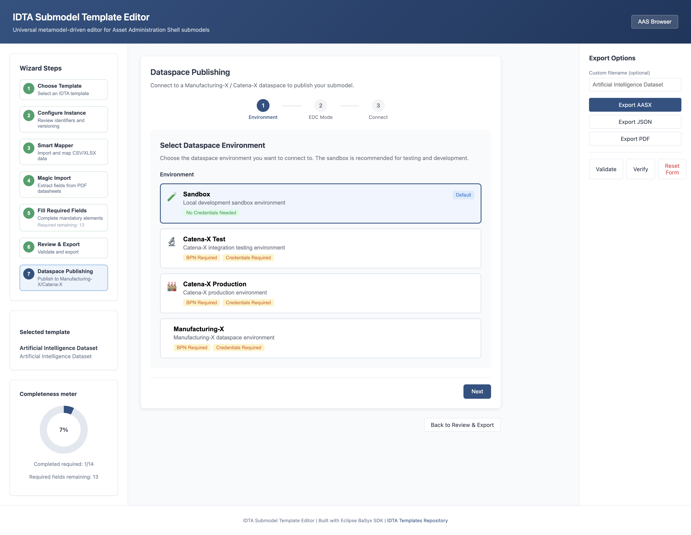

# Dataspace Publishing (Manufacturing-X / Catena-X)

Connect your submodels to a dataspace with a guided wizard, Vault-backed credential storage, and real health checks. The connector supports sandbox mode for local testing and Catena-X / Manufacturing-X environments for production-aligned deployments.



## Highlights

- **Wizard-based onboarding** with environment selection and EDC mode
- **Vault-backed secrets** (required for non-sandbox environments)
- **Health-driven status** (Connected / Degraded / Failed) based on real endpoint checks
- **Granular policy control** using ODRL policy templates

## Quick Start (Local)

```bash
# Start core stack
docker-compose up -d

# Enable dataspace in backend + configure Vault token
DATASPACE_ENABLED=true VAULT_TOKEN=dev-root-token docker-compose up -d backend

# Start Vault (dataspace profile)
docker-compose --profile dataspace up -d vault
```

## Full Dataspace Stack (EDC + DTR + BaSyx)

The full dataspace profile pulls EDC images from GHCR. You must authenticate first:

```bash
docker login ghcr.io
docker-compose --profile dataspace up -d
```

## Configuration

| Variable | Description | Default |
|----------|-------------|---------|
| `DATASPACE_ENABLED` | Enable dataspace features | false |
| `DATASPACE_DEFAULT_ENVIRONMENT` | Default dataspace environment | sandbox |
| `DATASPACE_DEFAULT_EDC_MODE` | Default EDC mode | tractus-x |
| `BASYX_AAS_SERVER_URL` | BaSyx AAS server URL | http://basyx-aas-server:4001 |
| `BASYX_REGISTRY_URL` | BaSyx registry URL | http://basyx-registry:4002 |
| `EDC_CONTROL_PLANE_URL` | EDC control plane URL | http://edc-control-plane:19192 |
| `EDC_DATA_PLANE_URL` | EDC data plane URL | http://edc-data-plane:19291 |
| `DTR_URL` | Digital Twin Registry URL | http://dtr:4003 |
| `VAULT_URL` | Vault URL | http://vault:8200 |
| `VAULT_TOKEN` | Vault token | - |

## API Endpoints

- `POST /api/dataspace/connections` - Create a dataspace connection (onboarding)
- `GET /api/dataspace/connections` - List dataspace connections
- `GET /api/dataspace/connections/{connection_id}` - Connection status + health checks
- `POST /api/dataspace/publications` - Publish a submodel to the dataspace
- `GET /api/dataspace/health` - Dataspace health status

## Architecture

The dataspace connector integrates with:

- **Eclipse BaSyx AAS Server** - Hosts submodel instances
- **Catena-X Digital Twin Registry (DTR)** - Registers digital twins for discovery
- **Tractus-X EDC** - Handles sovereign data exchange with ODRL policies
- **HashiCorp Vault** - Secures credentials and certificates
