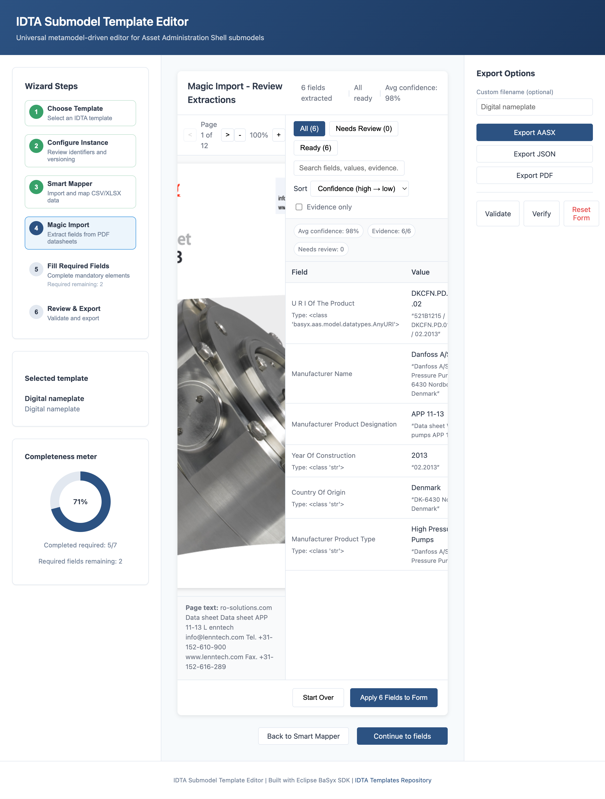
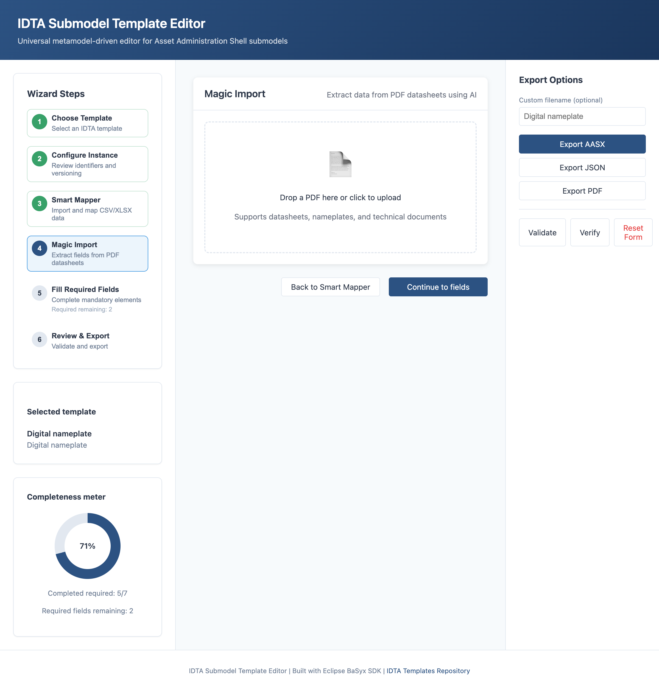
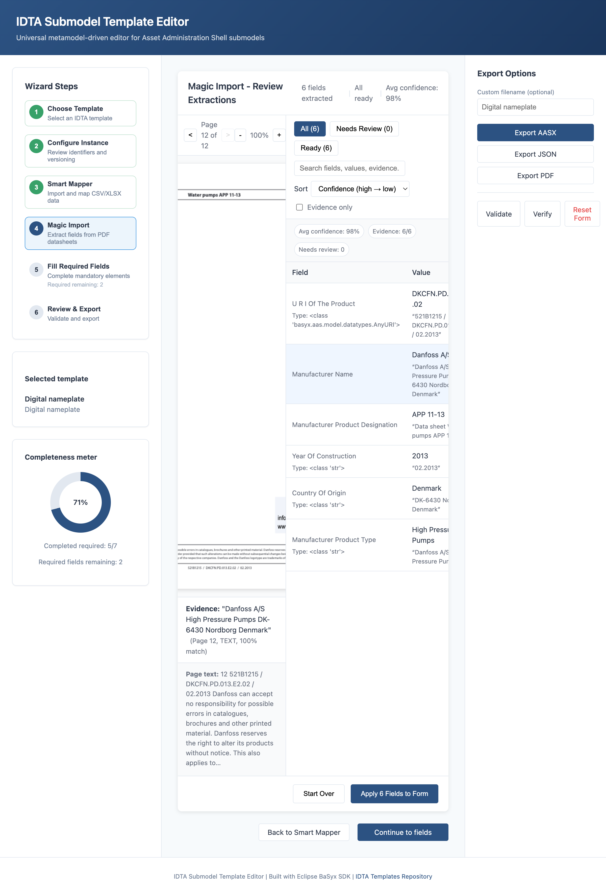
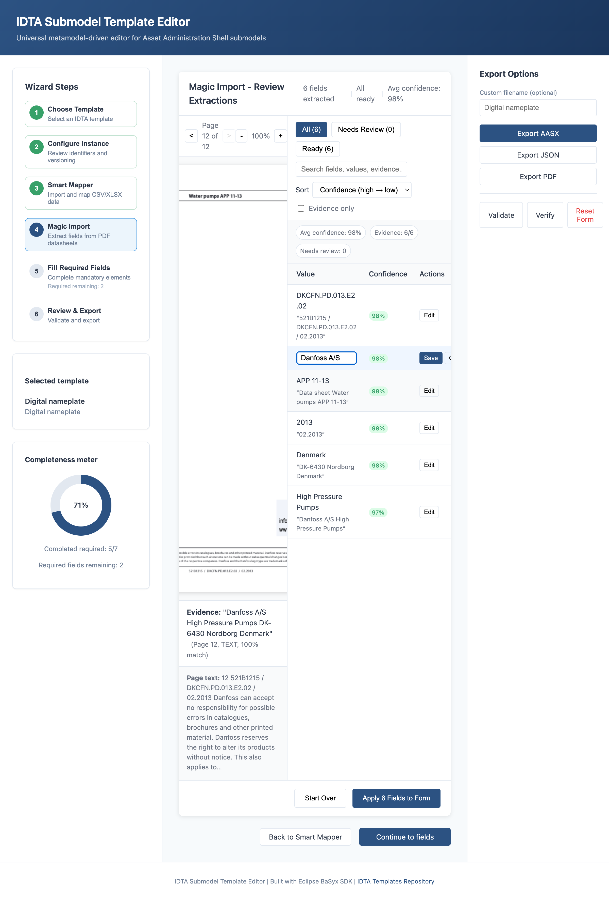
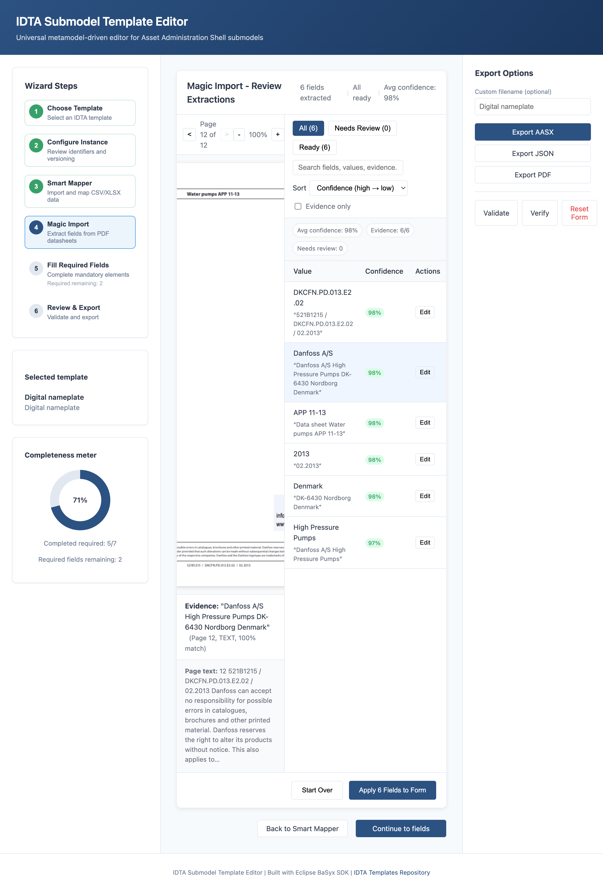

# Magic Import (PDF-to-AAS Extraction)

Upload a PDF datasheet or nameplate and let an LLM extract field values directly into your IDTA submodel form. Magic Import provides source highlighting, confidence scoring, and full transparency over extracted data.



## Key Capabilities

- **Privacy-First Extraction**: Only relevant snippets are sent to the LLM, not the full document. OpenAI Responses requests are sent with response storage disabled.
- **Multi-Provider LLM Support**: OpenAI (GPT-5.5), Anthropic (Claude), OpenRouter (100+ models), or local Ollama models
- **OCR Support**: Tesseract-based OCR for scanned PDFs with configurable language and DPI
- **Confidence Scoring**: 4-signal weighted formula (LLM confidence, evidence match, OCR quality, format rules)
- **Source Highlighting**: Click any extracted field to highlight the exact source region in the PDF viewer
- **Review Workflow**: Fields below 80% confidence are flagged for human review before applying

## How It Works

```
Upload PDF → Index Text → OCR (if needed) → Schema Resolution → BM25 Retrieval → LLM Extraction → Evidence Localization → Confidence Scoring → Review & Apply
```

1. **PDF Indexer**: Extracts text with word-level bounding boxes using PyMuPDF
2. **OCR Engine**: Falls back to Tesseract for scanned pages
3. **Schema Resolver**: Enumerates target fields from the selected template with semantic hints
4. **BM25 Retriever**: Finds relevant snippets using keyword matching (privacy-preserving)
5. **LLM Extractor**: Extracts structured values from snippets with evidence quotes
6. **Evidence Localizer**: Maps LLM quotes back to PDF coordinates using fuzzy matching
7. **Confidence Scorer**: Combines signals into a single 0–1 confidence score

## Confidence Scoring Formula

```
confidence = 0.35 × llm + 0.40 × localizer + 0.15 × ocr + 0.10 × rules
```

| Signal | Weight | Description |
|--------|--------|-------------|
| `llm` | 35% | LLM self-reported confidence |
| `localizer` | 40% | Evidence quote match quality (fuzzy string matching) |
| `ocr` | 15% | Text extraction quality (1.0 for native PDF, lower for OCR) |
| `rules` | 10% | Format/type validation (dates, numbers, enums) |

## UI Overview

| Screenshot | Description |
|------------|-------------|
|  | Drag-drop zone for PDF upload and template selection |
|  | Split view: PDF viewer (left) + extraction table (right) with filter tabs |
|  | Click field → PDF evidence highlighted with quote display |
|  | Inline editing mode with text input |
|  | "Apply X Fields to Form" button enabled, ready to apply |

### Confidence Badges

The extraction table displays confidence badges indicating extraction quality:

| Badge | Condition | Description |
|-------|-----------|-------------|
| **Edited** | User modified | User changed the extracted value (blue) |
| **Approved** | User confirmed | User approved a low-confidence extraction (green) |
| **High** | ≥90% confidence | Auto-approved, high extraction confidence (green) |
| **Medium** | 80–89% confidence | Auto-approved, moderate confidence (neutral) |
| **Low** | <80% confidence | Needs review, amber badge with "Approve" button |

Users can filter the table using tabs: **All** / **Needs Review** / **Ready**. The "Approve All" button bulk-approves all low-confidence fields.

## Background Processing

Magic Import uses Celery + Redis for scalable job processing:

```bash
# Start with Magic Import profile
docker compose --profile magic-import up
```

Jobs progress through states: `UPLOADED` → `INDEXING` → `OCR` → `EXTRACTING` → `LOCALIZING` → `SCORING` → `DONE`

## Configuration

| Variable | Description | Default |
|----------|-------------|---------|
| `MAGIC_IMPORT_ENABLED` | Enable Magic Import feature | true |
| `MAGIC_IMPORT_LLM_PROVIDER` | LLM provider (openai, anthropic, openrouter, local) | openai |
| `MAGIC_IMPORT_LLM_MODEL` | Model name | gpt-5.5 |
| `MAGIC_IMPORT_LLM_MAX_RETRIES` | SDK retry attempts per request | 0 |
| `OPENAI_API_KEY` | OpenAI API key | - |
| `ANTHROPIC_API_KEY` | Anthropic API key | - |
| `OPENROUTER_API_KEY` | OpenRouter API key | - |
| `OLLAMA_BASE_URL` | Ollama server URL | http://localhost:11434 |
| `SETTINGS_STORAGE_DIR` | Directory for encrypted settings | ./cache/settings |
| `MAGIC_IMPORT_CONFIDENCE_THRESHOLD` | Flag fields below this score | 0.80 |
| `MAGIC_IMPORT_OCR_ENABLED` | Enable OCR fallback | true |
| `MAGIC_IMPORT_OCR_LANGUAGE` | Tesseract language codes | eng+deu |
| `MAGIC_IMPORT_OCR_DPI` | OCR resolution | 300 |
| `MAGIC_IMPORT_MAX_PDF_SIZE_MB` | Maximum PDF file size | 50 |
| `MAGIC_IMPORT_JOB_TTL_HOURS` | Job retention period | 24 |
| `CELERY_BROKER_URL` | Redis URL for Celery broker | redis://localhost:6379/0 |
| `CELERY_RESULT_BACKEND` | Redis URL for Celery results | redis://localhost:6379/0 |

## LLM Provider Setup

### OpenAI (default)

```bash
export MAGIC_IMPORT_LLM_PROVIDER=openai
export MAGIC_IMPORT_LLM_MODEL=gpt-5.5  # or gpt-5.5-pro
export OPENAI_API_KEY=sk-...
```

### Anthropic

```bash
export MAGIC_IMPORT_LLM_PROVIDER=anthropic
export MAGIC_IMPORT_LLM_MODEL=claude-3-haiku-20240307  # or claude-3-5-sonnet-20241022
export ANTHROPIC_API_KEY=sk-ant-...
```

### Local (Ollama)

```bash
export MAGIC_IMPORT_LLM_PROVIDER=local
export MAGIC_IMPORT_LLM_MODEL=llama3
export OLLAMA_BASE_URL=http://localhost:11434
```

### OpenRouter

```bash
export MAGIC_IMPORT_LLM_PROVIDER=openrouter
export MAGIC_IMPORT_LLM_MODEL=anthropic/claude-3.5-sonnet  # or another OpenRouter model
export OPENROUTER_API_KEY=sk-or-...
```

## LLM Settings UI

Configure LLM providers directly in the application without editing environment files.

### Accessing Settings

1. Navigate to **Magic Import** (Step 4 in wizard)
2. Click **"Configure Now →"** in the provider status bar
3. The LLM Provider Configuration panel opens

### Provider Selection

Four providers are supported:

| Provider | Description | API Key Required |
|----------|-------------|------------------|
| **OpenAI** | GPT-5.5, GPT-5.5 Pro, GPT-5.4 | Yes |
| **Anthropic** | Claude 3.5 Sonnet, Claude 3.5 Haiku, Claude 3 Opus | Yes |
| **OpenRouter** | 100+ models via unified API (Claude, GPT, Gemini, Llama) | Yes |
| **Local (Ollama)** | Self-hosted models (Llama, Mistral, Mixtral) | No |

### Configuration Workflow

1. **Select Provider** — Click a provider card
2. **Enter API Key** — Paste your key (masked for security)
3. **Validate** — Click "Validate" to test the connection
4. **Save** — Click "Save" to store encrypted credentials
5. **Select Model** — Choose from provider-specific models

### Security

- API keys are **encrypted at rest** using Fernet (AES-128-CBC)
- Keys are **validated** before storage
- Keys are displayed **masked** (e.g., `sk-...abc`)
- Keys are **never logged** or exported

### Advanced Settings

Expand "Advanced Settings" to configure:

- **Confidence Threshold** (50-100%) — Minimum confidence for auto-accept
- **Enable OCR** — Extract text from scanned documents

### Status Indicators

| Status | Indicator | Meaning |
|--------|-----------|---------|
| Connected | 🟢 | Provider configured and healthy |
| Checking | 🟡 | Validating connection |
| Error | 🔴 | Connection failed |
| Not configured | ⚪ | No API key set |

## API Endpoints

- `POST /api/magic-import/jobs` - Create extraction job from PDF upload
- `GET /api/magic-import/jobs/{job_id}` - Get job status and progress
- `GET /api/magic-import/jobs/{job_id}/result` - Get extraction results with confidence scores
- `GET /api/magic-import/jobs/{job_id}/pdf` - Download PDF for viewer
- `DELETE /api/magic-import/jobs/{job_id}` - Clean up job and associated files
- `GET /api/magic-import/jobs` - List recent jobs
- `POST /api/magic-import/health` - Service health check (LLM provider, OCR, Redis)
