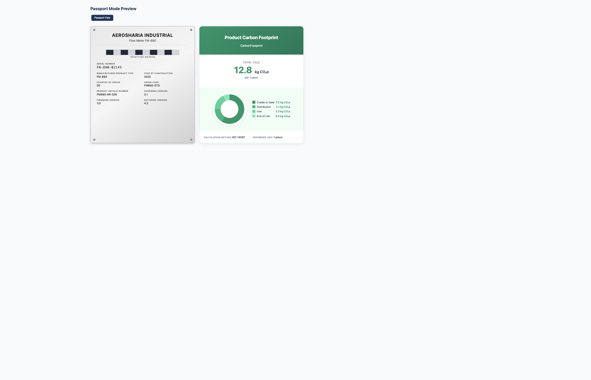
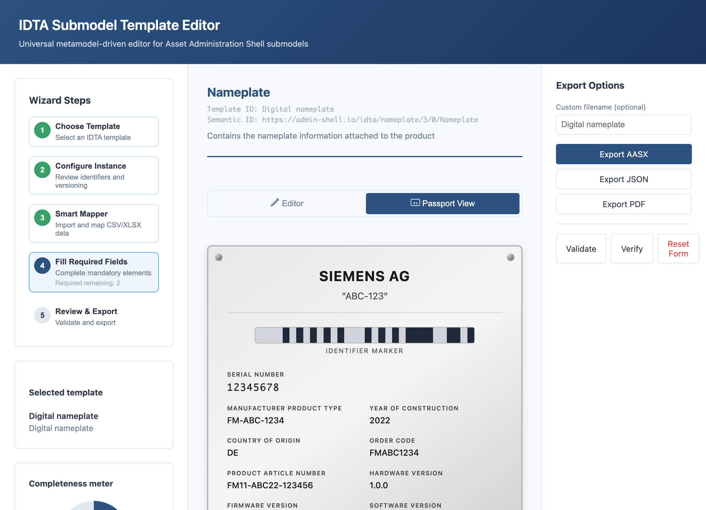
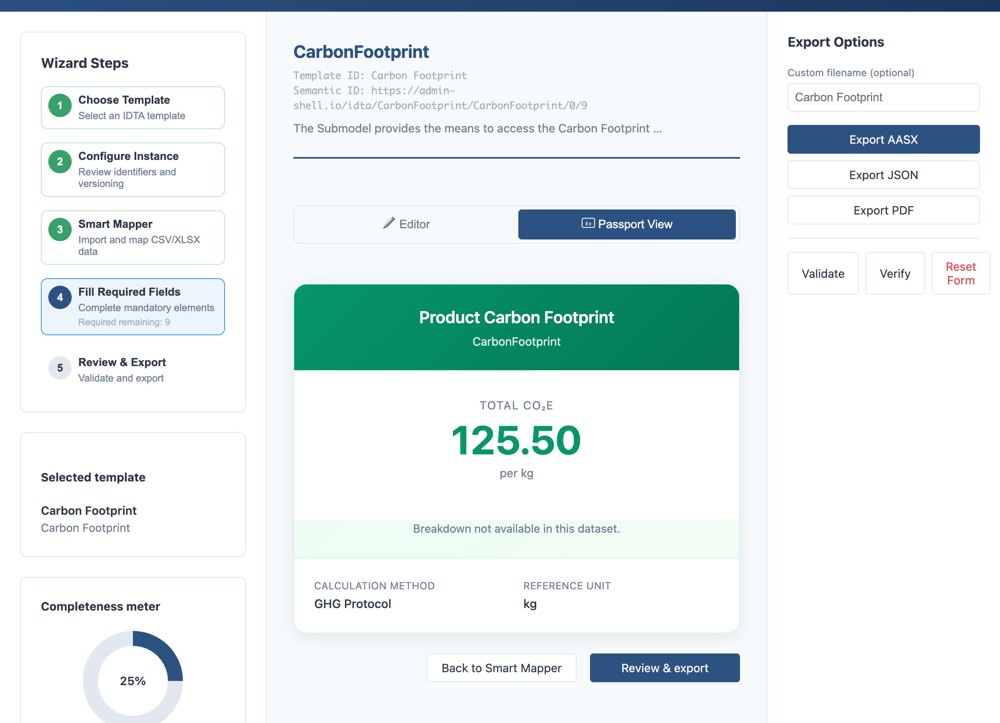

# Passport Mode (Digital Product Passport Visualization)

Switch between Editor and Passport views to visualize submodel data as Digital Product Passport cards. The system auto-detects template types and renders appropriate card styles.

## Preview

The preview below shows how Nameplate and Carbon Footprint templates render side-by-side for quick review.

## Supported Card Types

| Template | Card Type | Visual Style |
|----------|-----------|--------------|
| IDTA 02006 Nameplate | NameplateCard | Metal sticker with manufacturer info |
| IDTA 02023 Carbon Footprint | PCFCard | CO₂e metric display + breakdown pie chart (when available) |
| Other templates | GenericCard | Clean key-value layout |

| Screenshot | Description |
|------------|-------------|
|  | NameplateCard displays manufacturer, serial number, product type, and version info in a metal sticker style |
|  | PCFCard shows total CO₂e metric with calculation method and reference unit |

## Features

- **Mode Toggle**: Switch between Editor and Passport views with one click
- **Template Detection**: Auto-detects Nameplate (IDTA 02006) and PCF (IDTA 02023) via semanticId/submodelId + templateName + idShort
- **Schema-Indexed Extraction**: Resolves schema + form contexts to pull values safely without hardcoded paths
- **Deterministic Markers**: Identifier marker is generated from real IDs (no random or placeholder visuals)
- **PCF Visualization**: SVG pie chart + legend + accessible table, with clear fallback when breakdown is missing
- **Safe Rendering**: Strict numeric parsing, language fallback, safe URL handling, depth-limited GenericCard
- **Live Updates**: Form changes reflect instantly in passport view
- **Units by Template**: PCF units render only when provided by the schema
- **Print Support**: Clean print stylesheet for card output
- **Accessibility**: ARIA labels, keyboard navigation, reduced motion support

## Template Detection

The system uses a registry pattern with priority-based detection:

1. **semanticId / submodelId patterns** - highest priority (e.g., `02006`, `02023`)
2. **templateName patterns** - medium priority
3. **idShort patterns** - fallback (e.g., `Nameplate`, `CarbonFootprint`)

Detection is case-insensitive and supports ECLASS IDs.

## Testing

- **Unit tests** cover registry detection, schema indexing, value extraction, and pie chart math
- **Integration tests** verify toggle behavior and live form updates
