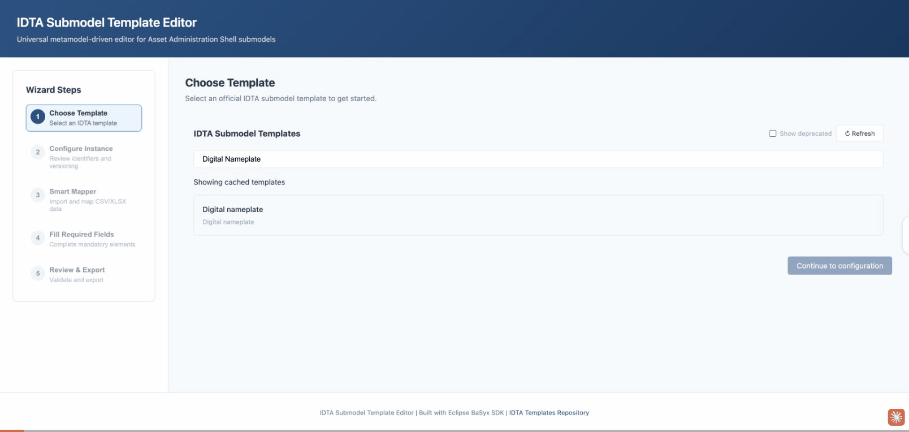

# Smart Mapper (CSV/XLSX Bulk Import)

Smart Mapper lets you upload a spreadsheet, map columns to template fields, and apply the results directly into the editor form. Save recipes for monthly imports and re-run with minimal setup.

## Features

- **Profile CSV/XLSX headers** + sample rows with column statistics (null rate, distinct count)
- **Drag-and-drop columns** onto targets with a visual mapping canvas
- **Semantic-aware auto-mapping** suggests matches using semantic synonyms and field names
- **Map columns → idShortPath targets** (including list paths via `[]`)
- **Transformation options** per mapping: trim whitespace, decimal/thousands separators, date format
- **Import modes**: single, row-per-submodel, and grouped (build list items per group)
- **Save recipes** locally or to the server (OIDC-aware scoping)
- **Template version tracking** warns when the template has been updated since the recipe was saved
- **Dry-run preview** shows mapped values before applying to the form
- **Validation panel** flags unmapped required fields and parsing warnings

## Workflow

1. Upload a CSV or XLSX file
2. Review column profiles (sample values, null rates, distinct counts)
3. Drag columns onto template fields or use auto-suggest
4. Configure transformations if needed
5. Preview mapped values
6. Apply to form or export directly

## Configuration

Recipes can be saved locally (browser storage) or to the server. When OIDC authentication is enabled, server-stored recipes are scoped to the authenticated user.

## API Endpoints

- `POST /api/mapper/profile` - Profile CSV/XLSX headers + sample rows (includes column statistics)
- `POST /api/mapper/auto-suggest` - Auto-suggest column mappings using semantic matching
- `POST /api/mapper/run` - Run mapping (form or export output)
- `GET /api/mapper/recipes` - List saved recipes (scoped by OIDC user if enabled)
- `POST /api/mapper/recipes` - Save recipe to server
- `GET /api/mapper/recipes/{name}` - Fetch a recipe
- `DELETE /api/mapper/recipes/{name}` - Delete a recipe
